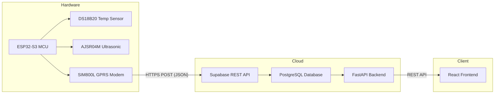
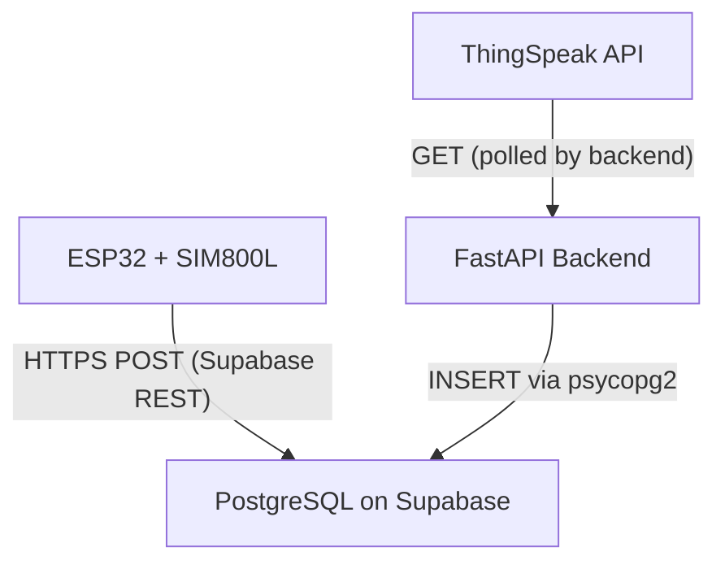

# AquaSense — Technology Stack Document

> **Project Title:** AquaSense — Smart Water Level Monitoring System  
> **Version:** 6.0  
> **Authors:** Samiksha Nalawade & Rajlakshmi Desai  
> **Institution:** IIT Hyderabad — IoT Workshop  
> **Date:** May 2026

---

## 1. Project Overview

**AquaSense** is an end-to-end Internet of Things (IoT) system designed for **real-time water tank monitoring**. It measures water level and temperature from cylindrical tanks deployed in the field, transmits sensor readings over a cellular (GPRS) network, stores them in a cloud-hosted PostgreSQL database, and visualises the data through a responsive web dashboard. A supplementary machine-learning module explores deep-learning models for water-usage disaggregation.

### 1.1 Key Capabilities

| Capability | Description |
|---|---|
| **Real-time sensing** | DS18B20 temperature sensor + AJSR04M ultrasonic sensor sampled every 15 s |
| **Cellular telemetry** | SIM800L GPRS modem sends HTTPS POST requests directly to Supabase |
| **Cloud persistence** | Supabase-hosted PostgreSQL with auto-created tables |
| **Live dashboard** | React SPA with KPI cards, interactive charts, node management, data export |
| **ML analytics** | CNN, LSTM, GRU models trained on water disaggregation data |
| **Cloud deployment** | Backend on Render, frontend on Vercel |

---

## 2. System Architecture



The system follows a **four-layer architecture**:

| Layer | Role | Key Technologies |
|---|---|---|
| **Hardware / Edge** | Sense + Transmit | ESP32-S3, SIM800L, DS18B20, AJSR04M, Arduino C++ |
| **Database** | Persist + Secure | Supabase (PostgreSQL), Row-Level Security, PostgREST |
| **Backend / API** | Orchestrate + Serve | Python 3, FastAPI, Uvicorn, psycopg2 |
| **Frontend / UI** | Visualise + Manage | React 18, Recharts, Axios, React Router |

---

## 3. Hardware Layer

### 3.1 Microcontroller — ESP32-S3

| Attribute | Detail |
|---|---|
| **Chip** | Espressif ESP32-S3 (dual-core Xtensa LX7, 240 MHz) |
| **Flash / RAM** | 4–16 MB Flash, 512 KB SRAM |
| **Connectivity** | Wi-Fi 802.11 b/g/n + BLE 5.0 (unused — GPRS used instead) |
| **I/O used** | GPIO 16 (OneWire), GPIO 17/18 (UART2 → ultrasonic), GPIO 9/10/11 (UART1 → SIM800L) |
| **IDE** | Arduino IDE / PlatformIO |

**Why ESP32-S3?** — Dual hardware UART peripherals allow simultaneous communication with the SIM800L modem and the serial ultrasonic sensor without software-serial overhead. Low power consumption makes it suitable for remote, potentially solar-powered deployments.

### 3.2 Sensors

#### 3.2.1 DS18B20 — Waterproof Temperature Sensor

| Attribute | Detail |
|---|---|
| **Protocol** | Dallas OneWire (single data wire) |
| **Range** | −55 °C to +125 °C (±0.5 °C accuracy) |
| **Library** | `DallasTemperature` + `OneWire` (Arduino) |
| **Purpose** | Measures water temperature; also used for **temperature-compensated distance** calculation |

**How it's used:** `tempSensor.requestTemperatures()` triggers a conversion; the reading is validated (−55 < T < 125) and stored. The temperature feeds into the speed-of-sound correction formula:

```
v_sound = 343 × √((T + 273) / 273)   [m/s]
```

#### 3.2.2 AJSR04M — Waterproof Ultrasonic Distance Sensor

| Attribute | Detail |
|---|---|
| **Interface** | UART (9600 baud); send `0x55`, receive 4-byte frame |
| **Range** | 2 cm – 800 cm |
| **Data frame** | `[0xFF] [MSB] [LSB] [checksum]` — distance in mm |
| **Purpose** | Measures the air gap above the water surface |

**How it's used:** Water level is derived as:

```
waterLevel = tankHeight − compensatedDistance
```

The firmware clamps the result to `[0, tankHeight]`.

### 3.3 Cellular Module — SIM800L (GPRS)

| Attribute | Detail |
|---|---|
| **Bands** | Quad-band GSM 850/900/1800/1900 MHz |
| **Data** | GPRS Class 12 (max 85.6 kbps) |
| **Interface** | AT commands over UART1 (9600 baud) |
| **Protocol** | HTTPS POST via `AT+HTTP*` commands with `AT+HTTPSSL=1` |

**Why GPRS over Wi-Fi?** — Water tanks are often located on rooftops or in rural areas without reliable Wi-Fi. A SIM card provides connectivity anywhere with cellular coverage.

**Communication flow:**
1. Bearer initialised with APN (`AT+SAPBR`)
2. Network time synced (`AT+CLTS=1` → `AT+CCLK?` for timestamps)
3. HTTP session opened; URL set to Supabase REST endpoint
4. SSL enabled (`AT+HTTPSSL=1`)
5. `apikey` header injected via `AT+HTTPPARA="USERDATA"`
6. JSON body uploaded via `AT+HTTPDATA`
7. POST executed (`AT+HTTPACTION=1`); HTTP 201 = success

### 3.4 Firmware Summary (`hw/hw.ino`)

| Aspect | Detail |
|---|---|
| **Language** | Arduino C++ (compiled via Arduino IDE) |
| **Libraries** | `OneWire`, `DallasTemperature`, `HardwareSerial` |
| **Sample interval** | 15 seconds (`SAMPLE_MS`) |
| **Data path** | ESP32 → SIM800L → GPRS → HTTPS → Supabase REST API |
| **Payload format** | `{"node_id":"NODE_001","field1":<temp>,"field2":<level>,"created_at":"<timestamp>"}` |
| **Error recovery** | On failed POST → `simReady = false` → full SIM re-init next cycle |
| **Lines of code** | 317 |

---

## 4. Database Layer — Supabase (PostgreSQL)

### 4.1 Why Supabase?

| Reason | Explanation |
|---|---|
| **Managed PostgreSQL** | No server provisioning; automatic backups, scaling |
| **Built-in REST API (PostgREST)** | Hardware can POST directly without a custom backend |
| **Row-Level Security** | Fine-grained access control via API key |
| **Free tier** | Suitable for academic projects |
| **Connection pooling** | Transaction pooler (`pooler.supabase.com:6543`) for backend connections |

### 4.2 Database Schema

#### Table: `sensor_data`

| Column | Type | Description |
|---|---|---|
| `id` | `SERIAL PRIMARY KEY` | Auto-incrementing row ID |
| `node_id` | `VARCHAR(50)` | Identifies which tank node sent the reading |
| `field1` | `FLOAT` | Temperature (°C) |
| `field2` | `FLOAT` | Water level (cm) |
| `created_at` | `TIMESTAMP` | When the reading was taken |

#### Table: `tank_sensorparameters`

| Column | Type | Description |
|---|---|---|
| `id` | `SERIAL PRIMARY KEY` | Auto-incrementing row ID |
| `node_id` | `VARCHAR(50)` | Unique tank identifier |
| `tank_height_cm` | `FLOAT` | Physical height of the tank |
| `tank_length_cm` | `FLOAT` | Stores the **diameter** (cylindrical tank) |
| `tank_width_cm` | `FLOAT` | Set to `0` to flag cylindrical geometry |
| `lat` | `FLOAT` | GPS latitude of the tank |
| `long` | `FLOAT` | GPS longitude of the tank |

### 4.3 Dual Ingest Paths



1. **Direct path (primary):** Hardware → Supabase REST API (no backend involved)
2. **ThingSpeak path (legacy/fallback):** Backend polls ThingSpeak → inserts into DB

---

## 5. Backend Layer — FastAPI (Python)

### 5.1 Technology Choices

| Technology | Version | Purpose | Why This Choice |
|---|---|---|---|
| **Python** | 3.10+ | Primary language | Rapid development, rich ecosystem |
| **FastAPI** | Latest | REST API framework | Async-ready, auto-generated OpenAPI docs, Pydantic validation |
| **Uvicorn** | Latest | ASGI server | High-performance async server for FastAPI |
| **psycopg2-binary** | Latest | PostgreSQL driver | Industry-standard, stable, direct SQL control |
| **Pydantic** | v2 | Data validation | Type-safe request/response models |
| **Requests** | Latest | HTTP client | Polling ThingSpeak API |

### 5.2 API Endpoints

| Method | Endpoint | Description |
|---|---|---|
| `GET` | `/refresh?node_id=` | Pulls latest reading from ThingSpeak, inserts into DB, returns it |
| `POST` | `/ingest` | Direct sensor data ingest (ESP32 → Backend → DB) |
| `POST` | `/tank-parameters` | Create a new tank node with dimensions & GPS coordinates |
| `GET` | `/tank-parameters` | List all registered tank nodes |
| `DELETE` | `/tank-parameters/{node_id}` | Delete a node and all its associated sensor data |
| `GET` | `/sensor-data?node_id=` | Retrieve last 100 readings (optionally filtered by node) |

### 5.3 Key Design Decisions

- **CORS wide open (`allow_origins=["*"]`)** — acceptable for a workshop project; in production, restrict to the Vercel domain.
- **Lifespan event** — `create_tables()` runs on startup to ensure schema exists.
- **No ORM** — Raw SQL via psycopg2 for simplicity and full control.
- **Connection pooling** — Uses Supabase's transaction pooler (port 6543) to avoid connection limits.

### 5.4 Deployment

| Attribute | Detail |
|---|---|
| **Platform** | [Render](https://render.com) (free tier) |
| **Entry point** | `uvicorn main:app --host 0.0.0.0 --port $PORT` |
| **Production URL** | `https://aquasense-backend-irnh.onrender.com` |
| **Environment vars** | `PORT` (set by Render) |

---

## 6. Frontend Layer — React Dashboard

### 6.1 Technology Choices

| Technology | Version | Purpose | Why This Choice |
|---|---|---|---|
| **React** | 18.2 | UI library | Component-based, large ecosystem, hooks API |
| **React Router DOM** | 6.30 | Client-side routing | Declarative routing between Dashboard and Node Creation |
| **Recharts** | 2.15 | Charting library | Built on React + D3; responsive, composable charts |
| **Axios** | 1.4 | HTTP client | Promise-based, interceptors, cleaner API than fetch |
| **Create React App** | 5.0.1 | Build toolchain | Zero-config Webpack + Babel setup |

### 6.2 Application Structure

```
frontend/src/
├── App.js              # Root — Router, ThemeContext, NavControlsContext
├── App.css             # Complete design system (336 lines)
├── index.js            # Entry point
├── components/
│   ├── Navbar.js       # Top bar: branding, controls, clock, theme toggle
│   └── Sidebar.js      # Slide-out navigation menu
└── pages/
    ├── Home.js         # Main dashboard (KPIs, chart, map)
    └── NodeCreation.js # Tank node CRUD management
```

### 6.3 Dashboard Features

| Feature | Implementation |
|---|---|
| **KPI Cards** | Temperature, Water Level, Volume (π r² h), Tank Fill %, Status (Online/Offline) |
| **Live Chart** | Dual-axis `LineChart` (temperature + water level) with toggle controls |
| **Time Filtering** | All Time, 1 h, 6 h, 24 h, 7 d |
| **Auto-Refresh** | Configurable interval (5 s / 10 s / 20 s / 1 min) |
| **Data Export** | JSON and CSV download |
| **Deployment Map** | Embedded OpenStreetMap iframe |
| **Stats Bar** | Min, Max, Avg for temperature and level; data-point count |
| **Node Selector** | Dropdown to switch between registered tank nodes |
| **Dark / Light Mode** | Full theme support via CSS custom properties |
| **Responsive Layout** | CSS Grid with media queries at 900 px and 600 px breakpoints |

### 6.4 Design System

| Aspect | Detail |
|---|---|
| **Fonts** | `Outfit` (UI) + `IBM Plex Mono` (data/monospace) — Google Fonts |
| **Colour palette** | Cyan (`#00d4aa`), Blue (`#4facfe`), Orange (`#ff9f43`), Pink (`#ff6b81`), Green (`#2ed573`), Violet (`#a55eea`) |
| **Dark theme BG** | `#080c16` → `#0c1220` → `#111a2e` (layered depth) |
| **Light theme BG** | `#f2f5f9` → `#e9edf3` → `#e0e5ed` |
| **Animations** | Live-indicator blink keyframe; hover transitions on buttons/cards |

### 6.5 Deployment

| Attribute | Detail |
|---|---|
| **Platform** | [Vercel](https://vercel.com) (free tier) |
| **Build** | `react-scripts build` |
| **Env variable** | `REACT_APP_API_URL` → points to Render backend URL |

---

## 7. Machine Learning / Analytics Layer

### 7.1 Overview

A supplementary research module explores deep-learning approaches for **water consumption disaggregation** — breaking down aggregate water-meter readings into individual appliance-level usage.

### 7.2 Technologies Used

| Technology | Purpose |
|---|---|
| **Python** | Primary language |
| **TensorFlow / Keras** | Deep learning framework |
| **Jupyter Notebook** | Interactive experimentation |
| **Pandas / NumPy** | Data manipulation |
| **Matplotlib** | Visualisation and animation |

### 7.3 Models Trained

| Model | Architecture | Saved File | Size |
|---|---|---|---|
| **CNN** | 1D Convolutional Neural Network | `CNN_model.h5` | 141 KB |
| **LSTM** | Long Short-Term Memory (RNN) | `LSTM_model.h5` | 249 KB |
| **GRU** | Gated Recurrent Unit (RNN) | `GRU_model.h5` | 203 KB |

Each model also has a lighter `*_viz_model.h5` variant used for generating learning-process animations.

### 7.4 Dataset

- **File:** `water_dissegration_data.csv` (3.9 MB)
- **Content:** Time-series water consumption data for disaggregation research

### 7.5 Notebooks

| Notebook | Purpose |
|---|---|
| `Water_Disaggregation_Final.ipynb` | Model training, evaluation, and comparison |
| `Model_Learning_Animations.ipynb` | Animated visualisations of the training process |
| `Model_Learning_Visualizations.ipynb` | Static training visualisations and metrics |

---

## 8. Communication Protocols

| Protocol | Where Used | Details |
|---|---|---|
| **OneWire** | ESP32 ↔ DS18B20 | Single-wire digital protocol for temperature |
| **UART (Serial)** | ESP32 ↔ SIM800L, ESP32 ↔ AJSR04M | 9600 baud, hardware serial |
| **AT Commands** | ESP32 → SIM800L | Hayes-compatible modem control |
| **GPRS** | SIM800L → Cell Tower | Packet data over GSM |
| **HTTPS** | SIM800L → Supabase | TLS-encrypted HTTP POST (SSL via `AT+HTTPSSL=1`) |
| **REST API** | Backend ↔ Frontend, Backend ↔ ThingSpeak | JSON over HTTP |
| **PostgREST** | Hardware → Supabase | Auto-generated REST API from PostgreSQL schema |
| **TCP (psycopg2)** | Backend → Supabase | Direct PostgreSQL wire protocol over SSL |

---

## 9. Development & Build Tools

| Tool | Purpose |
|---|---|
| **Arduino IDE** | Compiling and flashing ESP32 firmware |
| **Node.js / npm** | Frontend dependency management and build |
| **pip** | Python package management |
| **Git** | Version control |
| **VS Code** | Primary code editor |
| **Jupyter Notebook** | ML experimentation |

---

## 10. Third-Party Services

| Service | Role | Tier |
|---|---|---|
| **Supabase** | Managed PostgreSQL + REST API + Auth | Free |
| **Render** | Backend hosting (FastAPI) | Free |
| **Vercel** | Frontend hosting (React SPA) | Free |
| **ThingSpeak** | Legacy IoT data relay (Mathworks) | Free |
| **OpenStreetMap** | Embedded map on dashboard | Free / Open |
| **Google Fonts** | Typography (Outfit, IBM Plex Mono) | Free |

---

## 11. Complete Technology Summary Table

| Layer | Technology | Version | Role | Justification |
|---|---|---|---|---|
| **Hardware** | ESP32-S3 | — | Microcontroller | Dual UART, low power, Wi-Fi+BLE capable |
| | SIM800L | — | GPRS modem | Cellular connectivity for remote tanks |
| | DS18B20 | — | Temperature sensor | Waterproof, OneWire, high accuracy |
| | AJSR04M | — | Ultrasonic sensor | Waterproof, UART interface, long range |
| **Firmware** | Arduino C++ | — | Embedded code | Wide library support, fast prototyping |
| | OneWire lib | — | Sensor comm | Standard for Dallas sensors |
| | DallasTemperature lib | — | Temp reading | Abstracts OneWire protocol |
| **Backend** | Python | 3.10+ | Server language | Rapid development, ML integration |
| | FastAPI | Latest | REST framework | Async, auto-docs, validation |
| | Uvicorn | Latest | ASGI server | High performance for FastAPI |
| | psycopg2 | Latest | DB driver | Direct PostgreSQL access |
| | Pydantic | v2 | Validation | Type-safe models |
| | Requests | Latest | HTTP client | ThingSpeak polling |
| **Database** | PostgreSQL | 15 | RDBMS | Robust, ACID-compliant, extensible |
| | Supabase | — | DBaaS | Managed hosting, built-in REST API |
| **Frontend** | React | 18.2 | UI framework | Component model, hooks, ecosystem |
| | React Router | 6.30 | Routing | Declarative navigation |
| | Recharts | 2.15 | Charts | React-native charting on D3 |
| | Axios | 1.4 | HTTP client | Promise-based API calls |
| | CRA | 5.0.1 | Build tool | Zero-config Webpack/Babel |
| **ML** | TensorFlow/Keras | 2.x | Deep learning | Industry standard, easy model saving |
| | Jupyter | — | Notebooks | Interactive experimentation |
| **Deployment** | Render | — | Backend host | Free tier, auto-deploy from Git |
| | Vercel | — | Frontend host | Optimised for React, free tier |
| **Protocols** | HTTPS/TLS | — | Secure transport | End-to-end encryption |
| | REST/JSON | — | API standard | Universal, lightweight |
| | GPRS | — | Cellular data | Remote connectivity |

---

## 12. Repository Structure

```
iot/
├── hw/
│   └── hw.ino                              # ESP32 firmware (317 lines)
├── backend/
│   ├── main.py                             # FastAPI server (308 lines)
│   └── requirements.txt                    # Python dependencies
├── frontend/
│   ├── package.json                        # Node dependencies
│   ├── .env                                # API URL config
│   └── src/
│       ├── App.js                          # Root component + routing
│       ├── App.css                         # Complete design system
│       ├── index.js                        # Entry point
│       ├── components/
│       │   ├── Navbar.js                   # Top navigation bar
│       │   └── Sidebar.js                  # Side menu
│       └── pages/
│           ├── Home.js                     # Dashboard (KPIs + chart + map)
│           └── NodeCreation.js             # Node CRUD page
├── ml_model/
│   ├── Water_Disaggregation_Final.ipynb    # Training notebook
│   ├── Model_Learning_Animations.ipynb     # Animation notebook
│   ├── Model_Learning_Visualizations.ipynb # Viz notebook
│   ├── water_dissegration_data.csv         # Dataset (3.9 MB)
│   └── saved_models/                       # CNN, LSTM, GRU (.h5)
├── .gitignore
└── aquasense_system_explained.md
```

---

> **AquaSense v6.0** — © 2026 Samiksha Nalawade & Rajlakshmi Desai — IIT Hyderabad IoT Workshop
