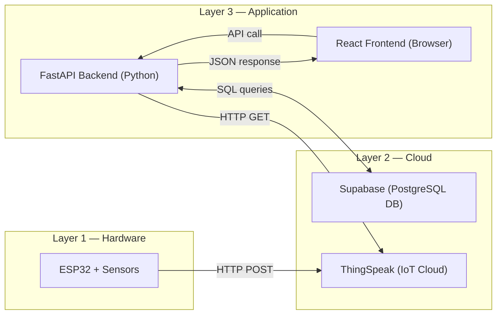
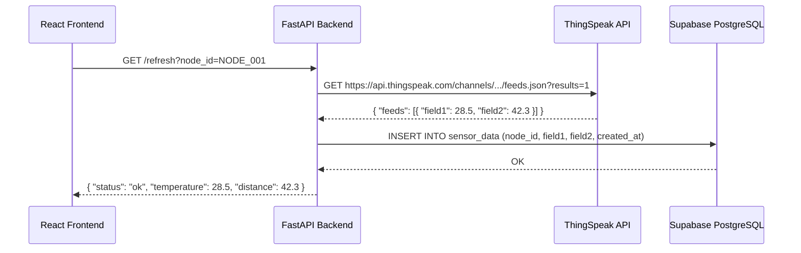
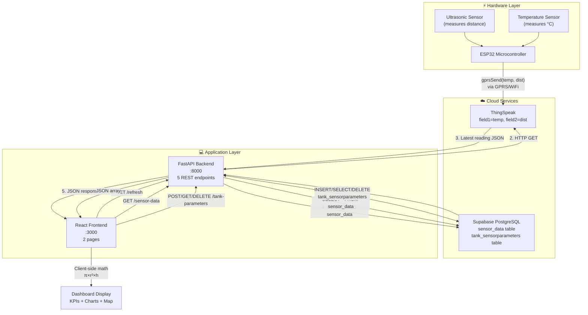

# AquaSense — Complete System Explanation

---

## 1. Project Structure (What Each File Does)

```
iot/
├── backend/
│   └── main.py              ← The entire backend server (FastAPI + Python)
│
├── frontend/src/
│   ├── App.js                ← Root component — routing, theme & context providers
│   ├── App.css               ← All styles for the entire app
│   ├── index.js              ← React entry point (mounts App into the DOM)
│   ├── components/
│   │   ├── Navbar.js         ← Top navigation bar (clock, theme toggle, controls)
│   │   └── Sidebar.js        ← Slide-out menu (Dashboard / Node Creation links)
│   └── pages/
│       ├── Home.js           ← Live Dashboard — charts, KPIs, map
│       └── NodeCreation.js   ← Create / view / delete tank nodes
│
└── ml_model/                 ← Machine learning model (separate, not part of live flow)
```

---

## 2. The Three-Layer Architecture

Your system has **three layers** that talk to each other:



| Layer | Technology | Role |
|-------|------------|------|
| **Hardware** | ESP32 microcontroller | Reads sensors, sends data to ThingSpeak |
| **IoT Cloud** | ThingSpeak | Receives raw sensor data, stores latest reading |
| **Database** | Supabase (PostgreSQL) | Permanent storage of all readings + tank configs |
| **Backend** | FastAPI (Python) | Bridges ThingSpeak ↔ Database ↔ Frontend |
| **Frontend** | React.js | Dashboard UI the user sees in the browser |

---

## 3. End-to-End Data Flow — Step by Step

### 🔵 Step 1: Hardware Sends Data → ThingSpeak

Your **ESP32 board** has two sensors attached:
- **Ultrasonic sensor** — measures the **distance** (in cm) from the sensor at the top of the tank to the water surface
- **Temperature sensor** — measures **temperature** (in °C)

The ESP32 runs a C/C++ program that periodically calls ThingSpeak's API using GPRS/Wi-Fi:
```
gprsSend(temperature, distance)
```
ThingSpeak receives this and stores it as:
- `field1` = temperature
- `field2` = distance

> [!IMPORTANT]
> **ThingSpeak acts as a buffer/relay.** It only holds the most recent readings. Your Supabase database is the permanent, long-term storage.

---

### 🟢 Step 2: Frontend Triggers a Refresh → Backend Fetches from ThingSpeak → Saves to Database

This is the **most critical step** and it happens every time the dashboard polls for new data.

**The sequence:**



**What happens in code** ([main.py](file:///c:/TY/Sem%206/iot%20IITH/WORKSHOP/databse/iot/backend/main.py#L106-L136)):

1. Frontend calls `GET /refresh?node_id=NODE_001`
2. Backend makes an HTTP GET request to the ThingSpeak API URL
3. Backend parses the JSON response → extracts `field1` (temperature) and `field2` (distance)
4. Backend **INSERTs** a new row into the `sensor_data` table in Supabase
5. Backend returns the new reading as JSON to the frontend

> [!NOTE]
> If `TEST_MODE = True` in main.py (line 75), the backend skips ThingSpeak entirely and generates **random fake data** for development/testing.

---

### 🟡 Step 3: Frontend Fetches Historical Data from Database

Immediately after triggering the refresh, the frontend also calls:

```
GET /sensor-data?node_id=NODE_001
```

This endpoint ([main.py line 230–265](file:///c:/TY/Sem%206/iot%20IITH/WORKSHOP/databse/iot/backend/main.py#L230-L265)):
- Queries the `sensor_data` table
- Returns the **last 100 readings** for that node, sorted newest first
- Returns them as JSON with fields: `id`, `node_id`, `temperature`, `distance`, `created_at`

---

### 🔴 Step 4: Frontend Does Client-Side Math & Renders the Dashboard

The frontend ([Home.js](file:///c:/TY/Sem%206/iot%20IITH/WORKSHOP/databse/iot/frontend/src/pages/Home.js)) takes the raw data and **calculates everything locally in the browser**:

| Calculation | Formula | Code Location |
|-------------|---------|---------------|
| **Water Level** | `Tank Height − Sensor Distance` | [Home.js line 44](file:///c:/TY/Sem%206/iot%20IITH/WORKSHOP/databse/iot/frontend/src/pages/Home.js#L44) |
| **Fill Percentage** | `(Water Level / Tank Height) × 100` | [Home.js line 45](file:///c:/TY/Sem%206/iot%20IITH/WORKSHOP/databse/iot/frontend/src/pages/Home.js#L45) |
| **Current Volume (L)** | `π × r² × Water Level / 1000` | [Home.js line 47](file:///c:/TY/Sem%206/iot%20IITH/WORKSHOP/databse/iot/frontend/src/pages/Home.js#L47) |
| **Total Capacity (L)** | `π × r² × Tank Height / 1000` | [Home.js line 48](file:///c:/TY/Sem%206/iot%20IITH/WORKSHOP/databse/iot/frontend/src/pages/Home.js#L48) |

Where `r = diameter / 2` (the tank is treated as a **cylinder**).

These values power the 5 **KPI cards** (Temperature, Water Level, Volume, Tank Fill %, Status) and the **Recharts line graph**.

---

## 4. The Database — Schema & Where to View Data

### Database Platform: **Supabase**

Supabase is a hosted PostgreSQL database. Your connection details are in [main.py lines 27–34](file:///c:/TY/Sem%206/iot%20IITH/WORKSHOP/databse/iot/backend/main.py#L27-L34):

| Property | Value |
|----------|-------|
| **Host** | `db.cguaghcgesxgmrghaghg.supabase.co` |
| **Port** | `5432` |
| **Database** | `postgres` |
| **User** | `postgres` |
| **SSL** | Required |

### How to View Your Stored Data

> [!TIP]
> **Go to [https://supabase.com/dashboard](https://supabase.com/dashboard)**, log in with your account, select your project, and click **Table Editor** in the left sidebar. You will see both tables and can browse/filter/edit all rows directly in the browser.

You can also use the **SQL Editor** in Supabase to run queries like:
```sql
-- See last 10 sensor readings
SELECT * FROM sensor_data ORDER BY created_at DESC LIMIT 10;

-- See all registered tank nodes
SELECT * FROM tank_sensorparameters;

-- Count total readings per node
SELECT node_id, COUNT(*) FROM sensor_data GROUP BY node_id;
```

---

### Table 1: `sensor_data`

Stores **every sensor reading** that was pulled from ThingSpeak.

| Column | Type | Description |
|--------|------|-------------|
| `id` | `SERIAL PRIMARY KEY` | Auto-incrementing unique row ID |
| `node_id` | `VARCHAR(50)` | Which tank node this reading belongs to (e.g. `NODE_001`) |
| `field1` | `FLOAT` | **Temperature** in °C |
| `field2` | `FLOAT` | **Distance** in cm (from ultrasonic sensor to water surface) |
| `created_at` | `TIMESTAMP` | When the reading was recorded |

**Example rows:**

| id | node_id | field1 | field2 | created_at |
|----|---------|--------|--------|------------|
| 1 | NODE_001 | 28.5 | 42.3 | 2026-03-31 14:30:00 |
| 2 | NODE_001 | 28.7 | 41.8 | 2026-03-31 14:30:20 |
| 3 | NODE_001 | 29.1 | 40.5 | 2026-03-31 14:30:40 |

---

### Table 2: `tank_sensorparameters`

Stores the **physical configuration** of each registered tank node.

| Column | Type | Description |
|--------|------|-------------|
| `id` | `SERIAL PRIMARY KEY` | Auto-incrementing unique row ID |
| `node_id` | `VARCHAR(50)` | Unique identifier for this tank |
| `tank_height_cm` | `FLOAT` | Total height of the cylindrical tank in cm |
| `tank_length_cm` | `FLOAT` | **Actually stores DIAMETER** of the cylindrical tank in cm |
| `tank_width_cm` | `FLOAT` | Always `0` — flags this as a cylindrical tank |
| `lat` | `FLOAT` | Latitude (GPS location of the tank) |
| `long` | `FLOAT` | Longitude (GPS location of the tank) |

> [!WARNING]
> The column is named `tank_length_cm` but it actually stores the **tank diameter**. Similarly `tank_width_cm` is always `0` for cylindrical tanks. This is a naming quirk in the schema.

---

## 5. All Backend API Endpoints

Your backend exposes **5 REST API endpoints** via FastAPI:

| Method | Endpoint | Purpose | Code |
|--------|----------|---------|------|
| `GET` | `/refresh?node_id=X` | Pull latest reading from ThingSpeak & save it to DB | [Lines 106–136](file:///c:/TY/Sem%206/iot%20IITH/WORKSHOP/databse/iot/backend/main.py#L106-L136) |
| `POST` | `/tank-parameters` | Create a new tank node (saves height, diameter, location) | [Lines 153–180](file:///c:/TY/Sem%206/iot%20IITH/WORKSHOP/databse/iot/backend/main.py#L153-L180) |
| `GET` | `/tank-parameters` | List all registered tank nodes | [Lines 186–209](file:///c:/TY/Sem%206/iot%20IITH/WORKSHOP/databse/iot/backend/main.py#L186-L209) |
| `DELETE` | `/tank-parameters/{node_id}` | Delete a node + all its sensor data | [Lines 214–223](file:///c:/TY/Sem%206/iot%20IITH/WORKSHOP/databse/iot/backend/main.py#L214-L223) |
| `GET` | `/sensor-data?node_id=X` | Get last 100 sensor readings (optionally by node) | [Lines 230–265](file:///c:/TY/Sem%206/iot%20IITH/WORKSHOP/databse/iot/backend/main.py#L230-L265) |

> [!TIP]
> FastAPI auto-generates interactive API documentation. When your backend is running, visit **http://127.0.0.1:8000/docs** to see a **Swagger UI** where you can test every endpoint directly.

---

## 6. Frontend Pages & How They Use the APIs

### Page 1: **Dashboard** (`/` → [Home.js](file:///c:/TY/Sem%206/iot%20IITH/WORKSHOP/databse/iot/frontend/src/pages/Home.js))

On load and every `refreshMs` milliseconds (default 20 seconds):

1. Calls `GET /tank-parameters` → gets list of nodes → populates the node selector dropdown
2. Calls `GET /refresh?node_id=<selected>` → triggers backend to fetch from ThingSpeak and save to DB
3. Calls `GET /sensor-data?node_id=<selected>` → gets last 100 readings → renders:
   - **5 KPI cards**: Temperature, Water Level, Volume, Tank Fill %, Status (Online/Offline)
   - **Line chart** (using Recharts library): Temperature & Water Level over time
   - **Stats bar**: Min / Max / Average for temperature and water level
   - **Map panel**: Embedded OpenStreetMap showing deployment location

### Page 2: **Node Creation** (`/node-creation` → [NodeCreation.js](file:///c:/TY/Sem%206/iot%20IITH/WORKSHOP/databse/iot/frontend/src/pages/NodeCreation.js))

- **Form** to create a new node: `POST /tank-parameters` with node_id, height, diameter, lat, long
- **Table** showing all existing nodes: `GET /tank-parameters`
- **Delete button** on each row: `DELETE /tank-parameters/{node_id}`
- **Live volume calculator**: computes `π × r² × h` as you type dimensions

---

## 7. The Polling / Auto-Refresh Mechanism

The dashboard does **NOT** use WebSockets or push notifications. Instead it uses **polling** — a timer that repeatedly asks the backend for new data.

```
┌─────────────────────────────────────────────┐
│  setInterval(fetchSensorData, refreshMs)    │
│                                             │
│  refreshMs options:                         │
│    5000  →  every 5 seconds                 │
│    10000 →  every 10 seconds                │
│    20000 →  every 20 seconds (DEFAULT)      │
│    60000 →  every 1 minute                  │
└─────────────────────────────────────────────┘
```

Code: [Home.js lines 141–145](file:///c:/TY/Sem%206/iot%20IITH/WORKSHOP/databse/iot/frontend/src/pages/Home.js#L141-L145)

Each poll cycle:
1. Calls `/refresh` → inserts a new row in `sensor_data`
2. Calls `/sensor-data` → fetches the updated history
3. Re-renders the entire dashboard with fresh numbers

---

## 8. Crucial Terms & Technologies Glossary

| Term | What It Is |
|------|------------|
| **FastAPI** | A modern Python web framework for building REST APIs. Auto-generates docs at `/docs`. |
| **Uvicorn** | An ASGI server that runs your FastAPI app. Started with `uvicorn.run(app, host="0.0.0.0", port=8000)`. |
| **REST API** | An architectural style where the frontend communicates with the backend via HTTP methods (GET, POST, DELETE). |
| **Endpoint** | A specific URL path on the backend that performs a specific action (e.g., `/refresh`, `/sensor-data`). |
| **CORS** | Cross-Origin Resource Sharing — middleware that allows your frontend (port 3000) to talk to the backend (port 8000). Without it, the browser blocks the requests. |
| **Pydantic** | A Python library for data validation. `BaseModel` classes (like `TankParameters`) define what fields the API expects and auto-validate incoming data. |
| **psycopg2** | The Python library used to connect to and query PostgreSQL databases. |
| **PostgreSQL** | An open-source relational database. Your data is stored in tables with rows and columns. |
| **Supabase** | A cloud-hosted PostgreSQL platform. Provides the database, a web dashboard (Table Editor), and a SQL Editor. Your data physically lives on Supabase's servers. |
| **ThingSpeak** | An IoT analytics cloud service by MathWorks. The ESP32 sends sensor data here via HTTP. The backend reads from here. |
| **ESP32** | A low-cost microcontroller with Wi-Fi/Bluetooth. It reads the physical sensors and sends data to ThingSpeak. |
| **GPRS** | A cellular data technology the ESP32 may use (via a SIM module) to connect to the internet and reach ThingSpeak. |
| **React** | A JavaScript library for building user interfaces. Your frontend is a React single-page application (SPA). |
| **React Router** | Handles client-side navigation between `/` (Dashboard) and `/node-creation` (Node Management) without full page reloads. |
| **Recharts** | A React charting library used to render the Temperature & Water Level line graphs. |
| **Axios** | A JavaScript HTTP client library. The frontend uses it to make API calls to your backend. |
| **Context API** | React's built-in state sharing mechanism. Used here for `ThemeContext` (dark/light mode) and `NavControlsContext` (passing controls into the Navbar). |
| **SERIAL PRIMARY KEY** | A PostgreSQL feature that auto-generates a unique incrementing integer for each new row. |
| **CRUD** | Create, Read, Update, Delete — the four basic database operations. Your app does C (POST), R (GET), and D (DELETE). |
| **Polling** | Repeatedly requesting data at fixed time intervals (as opposed to real-time push via WebSockets). |
| **SSL / sslmode=require** | Encrypts the connection between your backend and the Supabase database so credentials and data are secure in transit. |
| **IST** | Indian Standard Time (UTC+5:30). The Navbar clock and timestamps are converted to IST. |

---

## 9. How the Pieces Connect — Complete Picture



---

## 10. Quick Reference — Running the System

| Component | Command | URL |
|-----------|---------|-----|
| **Backend** | `python main.py` | http://127.0.0.1:8000 |
| **API Docs** | (auto) | http://127.0.0.1:8000/docs |
| **Frontend** | `npm start` (from `frontend/`) | http://localhost:3000 |
| **Database** | (browser) | https://supabase.com/dashboard → Table Editor |
